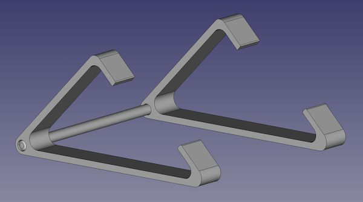

# device-stands
Custom 3D-modeled and 3D-printable stands for various devices.

## List of Stands

1. MacBook (Pro) Stand
    - 
    - Tested With:
        - 16" MacBook Pro (2019)
        - 13" MacBook Pro M1 (2021)
    - FreeCAD File:
        - [freecad-files/macbook-stand.FCStd](freecad-files/macbook-stand.FCStd)
    - Printing Notes
        - Print each part laid flat.  For extra rigidity, the two end pieces can be printed with 100% infill.  The connector spar may need some light sanding to properly fit into the other two peices, or it can be edited to have a smaller diameter and then printed.  Total print time for me was about 14 hours with 100% infill and default settings.
2. Kano PC Stand
    - `<Image pending>`
    - Tested With:
        - Kano PC (v1)
    - FreeCAD File:
        - `<File pending>`
    - Printing Notes
        - `<Notes pending>`