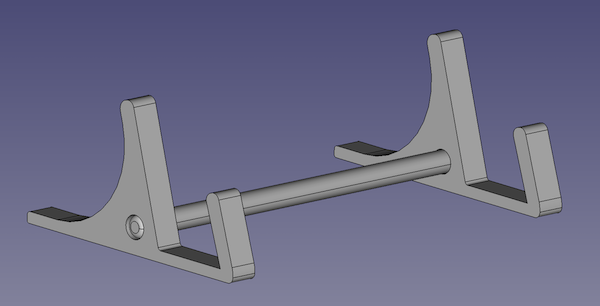

# device-stands
Custom 3D-modeled and 3D-printable stands for various devices.

## Models

### Stands

1. MacBook (Pro) Stand
    - 
    - Tested With:
        - 16" MacBook Pro (2019)
        - 13" MacBook Pro M1 (2021)
    - FreeCAD File:
        - [freecad-files/macbook-stand.FCStd](freecad-files/macbook-stand.FCStd)
    - Printing Notes
        - Print each part laid flat.  For extra rigidity, the two end pieces can be printed with 100% infill.  The connector spar may need some light sanding to properly fit into the other two peices, or it can be edited to have a smaller diameter and then printed.  Total print time for me was about 14 hours with 100% infill and default settings.
2. Kano PC Stand
    - 
    - Tested With:
        - Kano PC (v1)
    - FreeCAD File:
        - [freecad-files/kano-stand.FCStd](freecad-files/kano-stand.FCStd)
    - Printing Notes
        - Print each part laid flat.  20% infill was what I used, as these parts are not subjected to high strain.

### Additional Parts

1. Connector-spar
    - Spans between the two stands to add structure and rigidity.  (Can be seen in the above renders.)
    - FreeCAD File:
        - [freecad-files/connector-spar.FCStd](freecad-files/connector-spar.FCStd)
    - Printing Notes
        - This spar has only ever been printed laying flat on the bed, but if initial layer bed adhesion isn't an issue, the dimensions of the printed object may have stricter tolerances.  Either way it may be necessary to sand off or otherwise remove a bit of material from the spar in order to insert it into the stands.